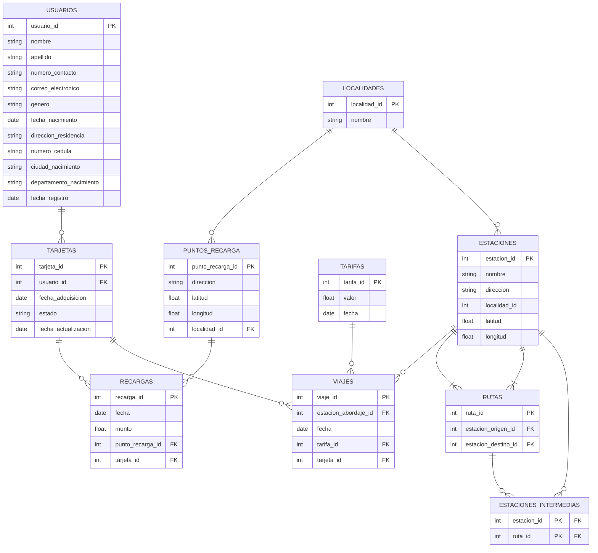

# Sistema de Recargas y Viajes de Transporte Público
Este proyecto contiene el diseño e implementación de una base de datos para el Módulo de Créditos y Viajes de un sistema de transporte público. El sistema permite la gestión de recargas de tarjetas y el seguimiento de viajes para los usuarios del sistema de transporte masivo. El objetivo de esta base de datos es mejorar la experiencia de los usuarios al ofrecer un sistema más eficiente para registrar y monitorear sus transacciones y viajes.

**Nota:** Este proyecto es un ejercicio académico y ha sido creado con el fin de practicar conceptos de diseño de bases de datos y no refleja la infraestructura real de un sistema de transporte.

## Diagrama relacional

## Descripción del Proyecto

### Contexto

Una empresa de transporte público de la ciudad de Bogotá ha decidido modernizar su sistema de recarga de tarjetas y seguimiento de viajes. Este módulo permitirá:

- Registro de usuarios y sus tarjetas de transporte.
- Gestión de puntos de recarga.
- Registro de recargas de saldo en las tarjetas.
- Registro y seguimiento de estaciones, rutas y viajes.

El sistema garantiza la trazabilidad de las recargas y de los viajes realizados por cada usuario, manteniendo un historial preciso de cada transacción y permitiendo consultas y auditorías.

### Funcionalidades Principales

**Usuarios:**

- Registro de usuarios y tarjetas.
- Gestión del saldo disponible en cada tarjeta.

**Puntos Autorizados de Recarga:**

- Registro de puntos de recarga, incluyendo su ubicación geográfica (latitud, longitud) y localidad.

**Recargas:**

- Registro de cada recarga con fecha, monto y ubicación del punto de recarga.
- Historial de tarifas para asegurar consultas precisas en cualquier momento.

**Estaciones y Rutas:**

- Registro de estaciones con su ubicación geográfica.
- Definición de rutas, incluyendo estaciones de origen, destino e intermedias.

**Viajes:**

- Registro de cada viaje realizado por los usuarios, incluyendo la estación de abordaje y el cálculo automático del saldo restante.

# Generador de Datos falsos
El siguiente Notebook genera datos falsos para el diagrama propuesto. Actualmente los datos generados pueden tener inconsistencias, sientase libre de usar y modificar el notebook para generar sus propios datos. 
https://colab.research.google.com/drive/1P0vnmkWPp9hxLaNTr7Ads2Osryb3bWIV?usp=sharing

# Contribuciones
Este proyecto está abierto a contribuciones. Si encuentras errores o tienes sugerencias para mejorar el sistema, por favor abre un issue o envía un pull request.
